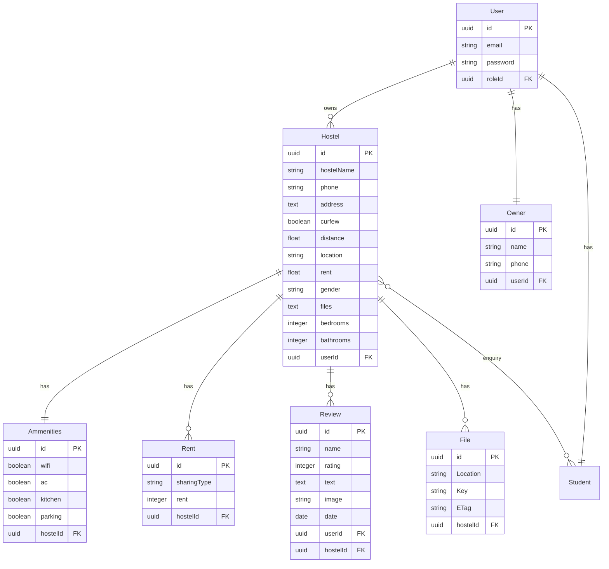

# PGBee `/hostel` Endpoint Documentation

## Table of Contents
- [Overview](#overview)
- [Architecture](#architecture)
- [Available Endpoints](#available-endpoints)
- [Data Models](#data-models)
- [Authentication & Authorization](#authentication--authorization)
- [Request/Response Examples](#requestresponse-examples)
- [Error Handling](#error-handling)
- [Database Relationships](#database-relationships)
- [Implementation Details](#implementation-details)
- [Missing Functionality](#missing-functionality)
- [Related Endpoints](#related-endpoints)

## Overview

The `/hostel` endpoint is the core API for managing hostel/PG (Paying Guest) accommodations in the PGBee application. It provides comprehensive CRUD operations for hostels along with related data including amenities, rent details, reviews, and file attachments.

**Base URL**: `/api/v1/hostel`

**Controller**: `hostel-controller.ts`  
**Routes**: `hostel-routes.ts`  
**Model**: `hostel-model.ts`

## Architecture

### File Structure
```
src/
├── controllers/
│   └── hostel-controller.ts     # Main business logic
├── models/
│   ├── hostel-model.ts         # Hostel data model
│   ├── relations.ts            # Database relationships
│   └── index.ts                # Model exports
├── routes/
│   └── hostel-routes.ts        # Route definitions
└── middlewares/
    └── auth-middleware.ts      # Authentication logic
```

### Technology Stack
- **Framework**: Express.js with TypeScript
- **ORM**: Sequelize
- **Validation**: Zod
- **Authentication**: JWT Bearer tokens
- **Database**: PostgreSQL (inferred from migrations)
- **File Storage**: AWS S3

## Available Endpoints

### 1. GET `/hostel` - List All Hostels (Student View)
**Purpose**: Retrieve all hostels for student browsing  
**Authentication**: ❌ Not Required (Public endpoint)  
**Controller Method**: `getAllHostelsStudent`

```http
GET /api/v1/hostel
```

**Response Structure**:
```json
{
  "success": true,
  "message": "Hostels fetched successfully",
  "data": {
    "hostels": [
      {
        "id": "uuid",
        "name": "Hostel Name",
        "hostelName": "Hostel Name",
        "phone": "1234567890",
        "address": "Full address",
        "curfew": false,
        "distance": 2.5,
        "location": "Area name",
        "rent": 8000,
        "gender": "men",
        "bedrooms": 2,
        "bathrooms": 1,
        "images": ["url1", "url2"],
        "User": {
          "id": "uuid",
          "email": "owner@email.com",
          "Owner": {
            "name": "Owner Name",
            "phone": "9876543210"
          }
        },
        "Reviews": [...],
        "Ammenities": {...},
        "Rents": [...],
        "Students": [...]
      }
    ]
  }
}
```

### 2. GET `/hostel/user` - Get Owner's Hostels
**Purpose**: Retrieve hostels belonging to authenticated owner  
**Authentication**: ✅ Required (Bearer Token)  
**Controller Method**: `getAllHostelsOwner`

```http
GET /api/v1/hostel/user
Authorization: Bearer <JWT_TOKEN>
```

### 3. POST `/hostel` - Create New Hostel
**Purpose**: Create a new hostel listing  
**Authentication**: ✅ Required (Bearer Token)  
**Controller Method**: `regHostel`

```http
POST /api/v1/hostel
Authorization: Bearer <JWT_TOKEN>
Content-Type: application/json
```

**Request Body Schema** (Zod Validation):
```json
{
  "hostelName": "string (required, min 1 char)",
  "phone": "string (required, min 10 chars)",
  "address": "string (required, min 1 char)",
  "curfew": "boolean",
  "description": "string (optional)",
  "distance": "number (required, min 0)",
  "location": "string (required, min 1 char)",
  "rent": "number (required, min 0)",
  "gender": "string (required, min 1 char)",
  "files": "string (optional)",
  "bedrooms": "number (required, min 1)",
  "bathrooms": "number (required, min 1)"
}
```

**Example Request**:
```json
{
  "hostelName": "Sunshine PG",
  "phone": "9876543210",
  "address": "123 Main Street, Sreekaryam, Trivandrum",
  "curfew": false,
  "description": "Modern PG with all amenities near KTU",
  "distance": 1.2,
  "location": "Near KTU",
  "rent": 12000,
  "gender": "women",
  "bedrooms": 3,
  "bathrooms": 2
}
```

### 4. PUT `/hostel/:id` - Update Hostel
**Purpose**: Update existing hostel (owner only)  
**Authentication**: ✅ Required (Bearer Token)  
**Authorization**: Only the owner who created the hostel  
**Controller Method**: `updateHostel`

```http
PUT /api/v1/hostel/{hostel_id}
Authorization: Bearer <JWT_TOKEN>
Content-Type: application/json
```

**Request Body**: Same schema as POST but all fields optional (partial update)

### 5. DELETE `/hostel/:id` - Delete Hostel
**Purpose**: Delete hostel listing (owner only)  
**Authentication**: ✅ Required (Bearer Token)  
**Authorization**: Only the owner who created the hostel  
**Controller Method**: `deleteHostel`

```http
DELETE /api/v1/hostel/{hostel_id}
Authorization: Bearer <JWT_TOKEN>
```

**Success Response** (204):
```json
{
  "success": true,
  "message": "Hostel deleted successfully",
  "data": {}
}
```

## Data Models

### Hostel Model Schema
```typescript
interface HostelAttributes {
  id?: string;              // UUID primary key
  hostelName?: string;      // Required, min 1 char
  phone?: string;           // Required, min 10 chars
  address?: string;         // Required, TEXT type
  curfew?: boolean;         // Default: false
  distance?: number;        // FLOAT, distance from landmark
  location?: string;        // Area/location name
  rent?: number;            // FLOAT, base rent amount
  gender?: string;          // "men"/"women"/"mixed"
  files?: string;           // TEXT, JSON string of file URLs
  bedrooms?: number;        // INTEGER, default: 1
  bathrooms?: number;       // INTEGER, default: 1
  userId?: string;          // UUID, foreign key to User
  createdAt?: Date;
  updatedAt?: Date;
}
```

### Database Table Structure
Based on the migration file, the `hostels` table includes:
- UUID primary key with UUIDV4 default
- All fields properly typed with constraints
- Timestamps with CURRENT_TIMESTAMP defaults

### Related Models

#### 1. User & Owner Information
```typescript
User: {
  id: string;
  email: string;
  // password excluded from responses
  Owner: {
    name: string;
    phone: string;
  }
}
```

#### 2. Amenities (One-to-One)
```typescript
Ammenities: {
  wifi: boolean;
  ac: boolean;
  kitchen: boolean;
  parking: boolean;
  laundry: boolean;
  tv: boolean;
  firstAid: boolean;
  workspace: boolean;
  security: boolean;
  currentBill: boolean;
  waterBill: boolean;
  food: boolean;
  furniture: boolean;
  bed: boolean;
  water: boolean;
  studentsCount: number;
}
```

#### 3. Rent Details (One-to-Many)
```typescript
Rents: [{
  id: string;
  sharingType: string;    // "single", "double", "triple", etc.
  rent: number;          // Rent for this sharing type
  hostelId: string;
}]
```

#### 4. Reviews (One-to-Many)
```typescript
Reviews: [{
  id: string;
  name: string;          // Reviewer name
  rating: number;        // 1-5 stars
  text: string;         // Review content
  image: string;        // Review image URL
  date: Date;           // Review date
  userId: string;       // Reviewer's user ID
  hostelId: string;
}]
```

#### 5. Files/Images (One-to-Many)
```typescript
Files: [{
  id: string;
  Location: string;      // S3 URL
  Key: string;          // S3 key
  key: string;          // Alternative key field
  ETag: string;         // S3 ETag
  hostelId: string;
}]
```

#### 6. Students/Enquiries (Many-to-Many)
```typescript
Students: [{
  // Student details through Enquiry join table
  enquiry: boolean;      // Enquiry status
  createdAt: Date;      // When enquiry was made
}]
```

## Authentication & Authorization

### Authentication Middleware
**File**: `auth-middleware.ts`

```typescript
// JWT Bearer Token validation
Authorization: Bearer <JWT_TOKEN>
```

**Process**:
1. Extract token from `Authorization` header
2. Verify JWT signature using `JWT_SECRET`
3. Extract user email from token
4. Fetch user from database
5. Attach user to `req.user`

### Authorization Rules
1. **Create Hostel**: Any authenticated user
2. **View All Hostels**: Public access (no auth)
3. **View Owner Hostels**: Owner sees only their hostels
4. **Update Hostel**: Only the owner who created it
5. **Delete Hostel**: Only the owner who created it

## Request/Response Examples

### Creating a Complete Hostel Workflow

#### Step 1: Register/Login User
```bash
# Register
POST /api/v1/auth/register
{
  "email": "owner@example.com",
  "password": "password123",
  "role": "owner"
}

# Login
POST /api/v1/auth/login
{
  "email": "owner@example.com",
  "password": "password123"
}
```

#### Step 2: Create Hostel
```bash
POST /api/v1/hostel
Authorization: Bearer <token>
{
  "hostelName": "JJ G",
  "phone": "9526569001",
  "address": "Durga lane 1, house no 34 Sasthankonam, near KTU, Sreekaryam P O. Pin 695017",
  "curfew": false,
  "distance": 0.5,
  "location": "Near KTU",
  "rent": 6000,
  "gender": "women",
  "bedrooms": 2,
  "bathrooms": 1
}
```

#### Step 3: Add Amenities
```bash
POST /api/v1/ammenities
Authorization: Bearer <token>
{
  "hostelId": "<hostel_id>",
  "wifi": true,
  "ac": false,
  "kitchen": true,
  "parking": true,
  "laundry": true,
  "tv": false,
  "firstAid": true,
  "workspace": false,
  "security": true
}
```

#### Step 4: Add Rent Details
```bash
POST /api/v1/rent
Authorization: Bearer <token>
{
  "hostelId": "<hostel_id>",
  "sharingType": "single",
  "rent": 6000
}
```

## Error Handling

### Common Error Responses

#### 400 - Bad Request (Validation Error)
```json
{
  "success": false,
  "message": "Hostel name is required",
  "data": {}
}
```

#### 401 - Unauthorized
```json
{
  "success": false,
  "message": "Unauthorized access",
  "data": {}
}
```

#### 403 - Forbidden
```json
{
  "success": false,
  "message": "You are not authorized to update this hostel",
  "data": {}
}
```

#### 404 - Not Found
```json
{
  "success": false,
  "message": "Hostel not found",
  "data": {}
}
```

#### 500 - Internal Server Error
```json
{
  "success": false,
  "message": "Failed to create hostel",
  "data": {}
}
```

### Validation Rules (Zod Schema)
- **hostelName**: Required string, minimum 1 character
- **phone**: Required string, minimum 10 characters
- **address**: Required string, minimum 1 character
- **curfew**: Boolean
- **description**: Optional string
- **distance**: Required number, minimum 0
- **location**: Required string, minimum 1 character
- **rent**: Required number, minimum 0
- **gender**: Required string, minimum 1 character
- **files**: Optional string
- **bedrooms**: Required number, minimum 1
- **bathrooms**: Required number, minimum 1

## Database Relationships



## Implementation Details

### Data Transformation
The API applies frontend-friendly transformations via `transformHostelForFrontend()`:

1. **Field Mapping**: `hostelName` → `name` (for compatibility)
2. **Image Processing**: 
   - Extracts URLs from `Files` relation
   - Falls back to `files` field if no File records
   - Provides placeholder if no images: `"https://placehold.co/300x300?text=No+Image"`
3. **Data Cleaning**: Excludes sensitive fields (passwords, unnecessary timestamps)

### Include Relations
```typescript
const includeAllRelations = [
  {
    model: User,
    attributes: { exclude: ["password", "createdAt", "updatedAt", "roleId"] },
    include: [{ model: Owner, attributes: { exclude: ["createdAt", "updatedAt", "userId"] } }]
  },
  { model: Review, attributes: { exclude: ["createdAt", "updatedAt", "hostelId"] } },
  { model: Ammenities, attributes: { exclude: ["createdAt", "updatedAt", "hostelId"] } },
  { model: File, attributes: { exclude: ["createdAt", "updatedAt", "hostelId"] } },
  { model: Rent, attributes: { exclude: ["createdAt", "updatedAt", "hostelId"] } },
  {
    model: Student,
    attributes: { exclude: ["createdAt", "updatedAt", "userId"] },
    through: { attributes: ["enquiry", "createdAt"] }
  }
];
```

### Request Logging
The application includes comprehensive request logging via `request-logger.ts`:
- Logs incoming requests with method, URL, IP, user agent
- Logs responses with status code, duration, response size
- Uses structured logging with the Logger utility

## Missing Functionality

### 1. Missing Route: GET `/hostel/:id`
**Issue**: Controller has `getHostelById` method but no corresponding route
**Impact**: Cannot fetch individual hostel details
**Recommendation**: Add route in `hostel-routes.ts`:
```typescript
hostelRouter.get("/:id", hostelController.getHostelById);
```

### 2. Search/Filter Functionality
**Current State**: No built-in filtering in hostel endpoints
**Available Workarounds**:
- Client-side filtering on returned data
- Use `/ammenities/filter` for amenity-based filtering

### 3. Pagination
**Issue**: All hostels returned in single response
**Impact**: Performance issues with large datasets
**Recommendation**: Implement pagination with limit/offset

## Related Endpoints

### File Management
- **POST** `/api/v1/file` - Upload hostel images to S3
- **GET** `/api/v1/file/:id` - Get file details

### Amenities Management
- **POST** `/api/v1/ammenities` - Create amenities for hostel
- **GET** `/api/v1/ammenities/:id` - Get hostel amenities
- **PUT** `/api/v1/ammenities/:id` - Update amenities
- **DELETE** `/api/v1/ammenities/:id` - Delete amenities

### Rent Management
- **POST** `/api/v1/rent` - Add rent details
- **GET** `/api/v1/rent/:id` - Get rent by hostel ID
- **PUT** `/api/v1/rent/:id` - Update rent
- **DELETE** `/api/v1/rent/:id` - Delete rent

### Review Management
- **POST** `/api/v1/review` - Create review
- **GET** `/api/v1/review/review/hostel/:id` - Get hostel reviews
- **GET** `/api/v1/review/user` - Get user reviews
- **PUT** `/api/v1/review/:id` - Update review
- **DELETE** `/api/v1/review/:id` - Delete review

### Enquiry Management
- **POST** `/api/v1/enquiry` - Create enquiry
- **GET** `/api/v1/enquiry/hostel/:id` - Get hostel enquiries
- **GET** `/api/v1/enquiry/student/:id` - Get student enquiries

## Data Migration & Seeding

The project includes data seeding functionality from CSV files:
- **Source**: `PG FORM (Responses) - Form Responses 1.csv`
- **Data Points**: Hostel names, owner details, amenities, pricing
- **Automated S3 Upload**: Images uploaded from local `photos/` directory
- **Mapping**: CSV data mapped to proper database schema

### Sample Data Structure
```csv
Hostel name,Type of PG,owner's name,owner's phone number,Address of the PG,Amenities,Price for single room,Curfew,Location
JJ G,JJ G,Geetha S,9526569001,"Durga lane 1, house no 34 Sasthankonam",wifi; mess provision,6000,false,Near KTU
```

## API Documentation

### Swagger/OpenAPI
- **Documentation URL**: `/docs`
- **API Spec URL**: `/api-spec`
- **Specification**: OpenAPI 3.0
- **Features**: Interactive documentation with try-it functionality

### Example Swagger Definition
```json
{
  "/hostels": {
    "get": {
      "tags": ["Hostels"],
      "summary": "Get all hostels",
      "responses": {
        "200": { "description": "List of hostels" }
      }
    },
    "post": {
      "tags": ["Hostels"],
      "summary": "Create a new hostel",
      "security": [{ "bearerAuth": [] }],
      "requestBody": {
        "required": true,
        "content": {
          "application/json": {
            "schema": {
              "type": "object",
              "properties": {
                "hostelName": { "type": "string" },
                "phone": { "type": "string" },
                "address": { "type": "string" },
                "rent": { "type": "number" },
                "gender": {
                  "type": "string",
                  "enum": ["male", "female", "mixed"]
                }
              }
            }
          }
        }
      }
    }
  }
}
```

## Performance Considerations

1. **Database Queries**: Uses eager loading for related data
2. **Response Size**: Large responses due to included relations
3. **Image Handling**: S3 integration for file storage
4. **Caching**: No caching implemented (recommendation for future)

## Security Considerations

1. **JWT Authentication**: Secure token-based auth
2. **Authorization Checks**: Owner-only operations protected
3. **Input Validation**: Comprehensive Zod schema validation
4. **Data Sanitization**: Sensitive fields excluded from responses
5. **CORS**: Configured for cross-origin requests

## Development Notes

- **TypeScript**: Fully typed with interfaces and type safety
- **Error Handling**: Centralized error handling with custom AppError class
- **Response Format**: Consistent response structure via ResponseHandler
- **Middleware**: Request logging and authentication middleware
- **Database**: Sequelize ORM with PostgreSQL

---

*Generated from PGBee server codebase scan on August 2, 2025*
